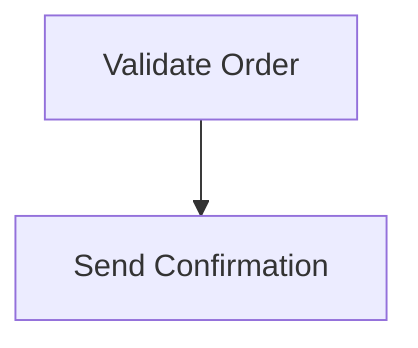

# Order Processing Workflow



## Tasks

### validate-order

**Language:** node  
**Entry:** validateOrder

```javascript
function validateOrder(order) {
  if (order.amount <= 0) throw new Error("Invalid amount");
  if (!order.customerEmail) throw new Error("Missing customer email");
  return { amount: order.amount, customerEmail: order.customerEmail, validated: true };
}
```

### send-confirmation

**Language:** node  
**Entry:** sendConfirmation

```javascript
function sendConfirmation(order) {
  return "Order confirmed for " + order.customerEmail + ", amount: $" + order.amount;
}
```


