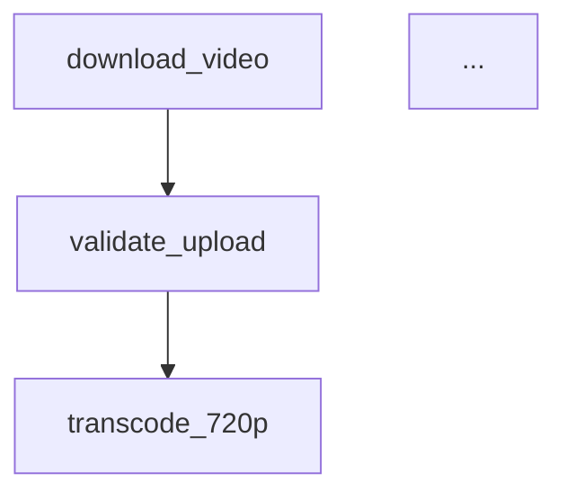

# Video Pipeline - OpenFlow Export Demo

Demonstrates exporting a Sayiir workflow to OpenFlow JSON and Mermaid formats using `sayiir-openflow`.

This example uses the same video processing pipeline structure as `video-pipeline-rs`, but instead of running the pipeline, it exports the workflow structure to two formats:
- **OpenFlow JSON** (Windmill-compatible format)
- **Mermaid markdown** flowchart

## What it does

1. Defines the video pipeline workflow structure with all 14 tasks
2. Exports to `workflow.openflow.json` 
3. Exports to `workflow.mermaid.md`
4. Exits without running the actual pipeline

## Run

```bash
cargo run
```

## Output files

### workflow.openflow.json
OpenFlow JSON specification (Windmill format) containing all workflow modules:
- download_video
- validate_upload  
- transcode_720p, transcode_1080p, transcode_4k
- generate_thumbnails
- moderate_content
- merge_results
- check_moderation
- upload_to_cdn, update_database, notify_user
- cleanup_artifacts, notify_rejection

### workflow.mermaid.md
Mermaid flowchart markdown showing the sequential task flow:



## Sayiir features demonstrated

| Feature | How it's used |
|---|---|
| **OpenFlow export** | `sayiir-openflow` crate for workflow visualization |
| **OpenFlowSpec** | Manual construction of workflow specification |
| **export_openflow_json** | JSON export to Windmill-compatible format |
| **export_mermaid** | Mermaid flowchart generation |

## Note

This example only exports the workflow structure. To see the actual running pipeline with ffmpeg transcoding, see the [video-pipeline-rs](../video-pipeline-rs) example.

The exported formats are useful for:
- Workflow documentation
- Visual representation in tools like Mermaid Live Editor
- Integration with workflow orchestration platforms like Windmill
- Migration between workflow engines
